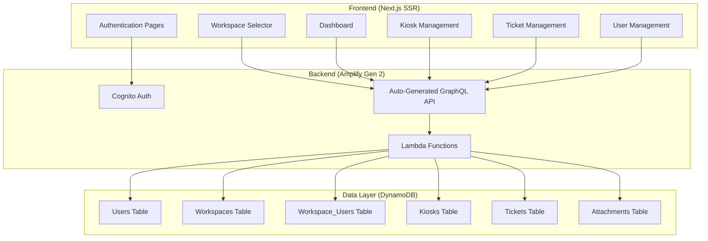
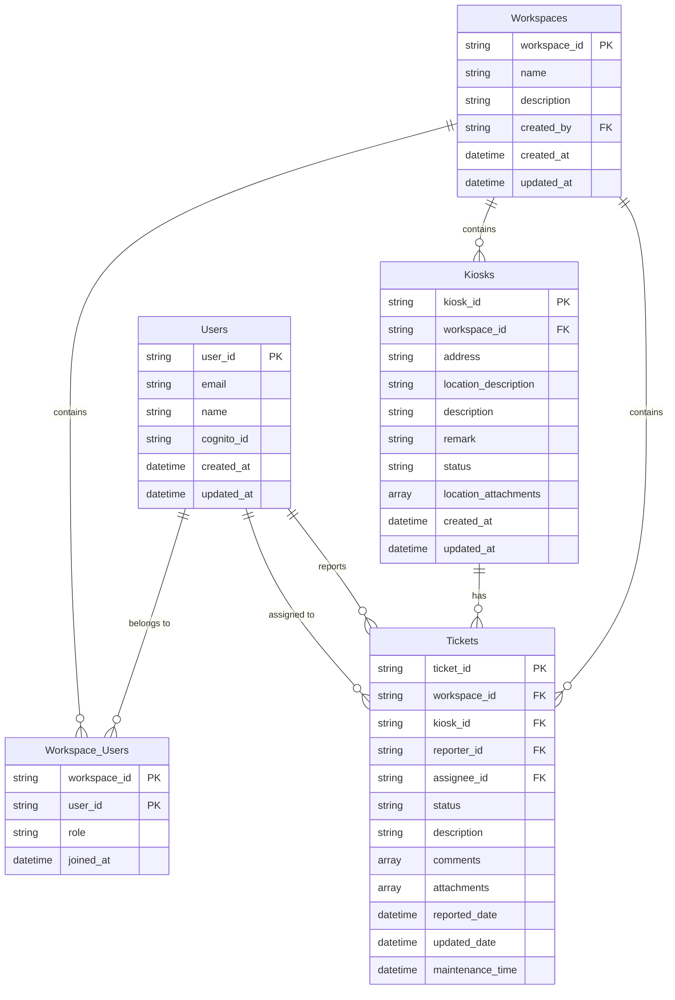

# System Patterns: Kiosk Maintenance Helpdesk

## Architecture Overview
Full-stack application using Next.js with Amplify Gen 2, implementing a multi-tenant workspace model with strict data isolation.



## Data Model Patterns

### Multi-Tenant Workspace Architecture
- **Workspace Isolation**: All data operations filtered by workspace_id
- **Access Control**: Junction table for user-workspace relationships
- **Role-Based Permissions**: Admin, Member, Viewer roles per workspace

### Entity Relationships


## Key Design Patterns

### 1. Workspace Context Pattern
- **Context Provider**: React context for current workspace
- **Route Protection**: Middleware to verify workspace access
- **Data Filtering**: All queries automatically filtered by workspace_id using built-in filters

### 2. Access Control Pattern
- **Role-Based Access Control (RBAC)**: Admin, Member, Viewer roles
- **Workspace Membership**: Junction table pattern for many-to-many relationships
- **Permission Gates**: Component-level permission checking

### 3. Server-Side Rendering Pattern
- **SSR Requirement**: All pages must use SSR for security and performance
- **Data Fetching**: Server-side data fetching with proper authentication
- **State Hydration**: Proper client-side state hydration

### 4. File Attachment Pattern
- **S3 Storage**: Attachments stored in S3 with workspace-based folder structure
- **Signed URLs**: Temporary signed URLs for secure file access
- **Metadata Storage**: File metadata in DynamoDB for querying

## API Design Patterns

### Amplify Gen 2 Client Usage
Using the auto-generated client methods instead of custom GraphQL queries:

```typescript
import { generateClient } from 'aws-amplify/data';
import { type Schema } from '@/amplify/data/resource';

const client = generateClient<Schema>();

// Basic CRUD Operations
const { data: kiosks, errors } = await client.models.Kiosk.list();
const { data: kiosk, errors } = await client.models.Kiosk.get({ id: 'kiosk-id' });
const { data: newKiosk, errors } = await client.models.Kiosk.create({ /* data */ });
const { data: updatedKiosk, errors } = await client.models.Kiosk.update({ /* data */ });
const { data: deletedKiosk, errors } = await client.models.Kiosk.delete({ id: 'kiosk-id' });
```

### Workspace-Filtered Queries
```typescript
// List kiosks for specific workspace
const { data: workspaceKiosks, errors } = await client.models.Kiosk.list({
  filter: {
    workspaceId: { eq: currentWorkspaceId }
  }
});

// List tickets by status for workspace
const { data: openTickets, errors } = await client.models.Ticket.list({
  filter: {
    and: [
      { workspaceId: { eq: currentWorkspaceId } },
      { status: { eq: 'OPEN' } }
    ]
  }
});

// List user's assigned tickets across workspaces
const { data: myTickets, errors } = await client.models.Ticket.list({
  filter: {
    assigneeId: { eq: currentUserId }
  }
});
```

### Advanced Filtering Patterns
```typescript
// Complex workspace filtering
const { data: maintenanceKiosks, errors } = await client.models.Kiosk.list({
  filter: {
    and: [
      { workspaceId: { eq: currentWorkspaceId } },
      { status: { eq: 'MAINTENANCE' } }
    ]
  }
});

// Search tickets by description
const { data: searchResults, errors } = await client.models.Ticket.list({
  filter: {
    and: [
      { workspaceId: { eq: currentWorkspaceId } },
      { description: { contains: searchTerm } }
    ]
  }
});

// Date range filtering for tickets
const { data: recentTickets, errors } = await client.models.Ticket.list({
  filter: {
    and: [
      { workspaceId: { eq: currentWorkspaceId } },
      { reportedDate: { ge: startDate } },
      { reportedDate: { le: endDate } }
    ]
  }
});
```

### Pagination Patterns
```typescript
// Paginated workspace kiosks
const { data: kiosks, nextToken, errors } = await client.models.Kiosk.list({
  filter: { workspaceId: { eq: currentWorkspaceId } },
  limit: 20,
  nextToken: previousToken
});

// Paginated tickets with sorting
const { data: tickets, nextToken, errors } = await client.models.Ticket.list({
  filter: { workspaceId: { eq: currentWorkspaceId } },
  limit: 50,
  nextToken: previousToken
});
```

### Real-time Subscriptions
```typescript
// Real-time workspace ticket updates
useEffect(() => {
  const sub = client.models.Ticket.observeQuery({
    filter: { workspaceId: { eq: currentWorkspaceId } }
  }).subscribe({
    next: ({ items, isSynced }) => {
      setTickets([...items]);
    },
  });
  return () => sub.unsubscribe();
}, [currentWorkspaceId]);

// Real-time kiosk status updates
useEffect(() => {
  const sub = client.models.Kiosk.observeQuery({
    filter: { workspaceId: { eq: currentWorkspaceId } }
  }).subscribe({
    next: ({ items, isSynced }) => {
      setKiosks([...items]);
    },
  });
  return () => sub.unsubscribe();
}, [currentWorkspaceId]);
```

### Data Access Patterns
- **Built-in Filtering**: Use Amplify's filter system for workspace isolation
- **Automatic Type Safety**: TypeScript types generated from schema
- **Optimistic Updates**: Built-in optimistic UI support
- **Caching**: Automatic query caching and synchronization

## Security Patterns

### Authentication Flow
1. Cognito JWT token validation
2. User identity extraction
3. Workspace access verification through filtering
4. Role-based permission checking

### Data Isolation
- All list queries include workspace_id filter
- S3 folder structure: `workspace-{id}/attachments/`
- No cross-workspace data leakage through filtering

## State Management Patterns

### Client-Side State
- **React Context**: Workspace context, user context
- **Local State**: Component-specific state with React hooks
- **Server State**: Built-in Amplify client caching and real-time updates

### URL State Management
- Workspace ID in URL path: `/workspace/{id}/tickets`
- Query parameters for filters and pagination
- Deep linking support for all views

## UI/UX Patterns

### Layout Structure
- **App Shell**: Consistent navigation and workspace selector
- **Workspace Navigation**: Sidebar with workspace-specific sections
- **Responsive Design**: Mobile-first responsive layouts

### Component Patterns
- **Compound Components**: Flexible, reusable UI components
- **Custom Hooks**: For data fetching and real-time subscriptions
- **Higher-Order Components**: For access control and workspace context

## Performance Patterns

### Caching Strategy
- **Built-in Caching**: Amplify client handles query caching automatically
- **Real-time Sync**: observeQuery provides automatic cache updates
- **Next.js**: Static generation where possible
- **CDN**: CloudFront for static assets

### Optimization
- **Code Splitting**: Route-based code splitting
- **Lazy Loading**: Component and data lazy loading
- **Selection Sets**: Fetch only needed fields to optimize data transfer
- **Image Optimization**: Next.js Image component

## Error Handling Patterns
- **Global Error Boundary**: React error boundaries
- **Client Error Handling**: Handle errors from Amplify client operations
- **User Feedback**: Toast notifications and error states
- **Logging**: Structured logging for debugging 